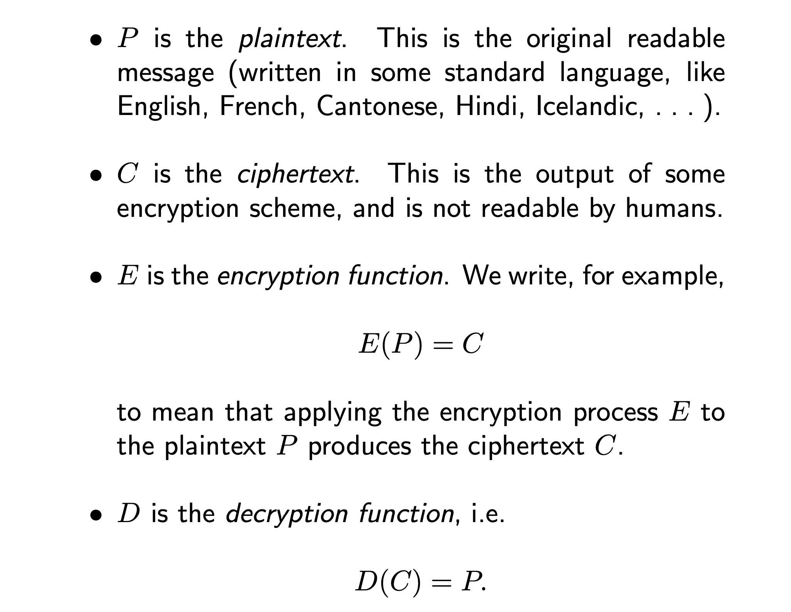
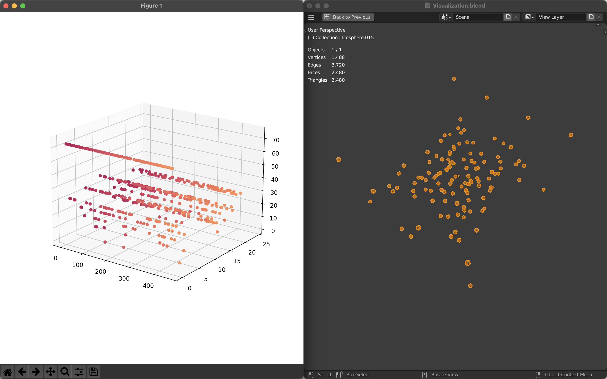
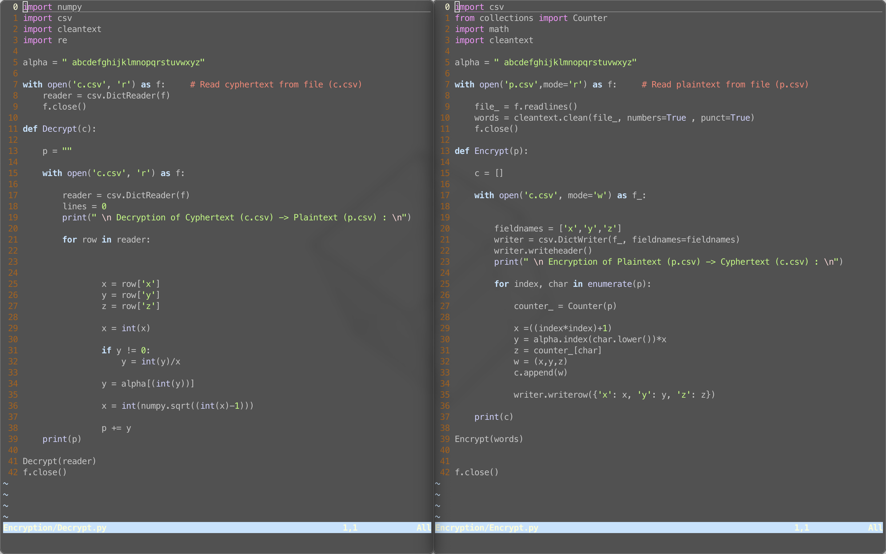

# Geometric-Encryption

[](https://github.com/tterb/atomic-design-ui/blob/master/LICENSEs)   []()


This project implements basic encryption techniques to encode and visualize text data


## Run Locally

Clone the project

```bash
  git clone https://github.com/theo-kirby/geometric-encryption
```

Go to the project directory

```bash
  cd geometric-encryption
```

Install dependencies

```bash
  pip3 install -r Resources/requirements.txt

```

Encrypt (p.csv) -> (c.csv)
```bash
python3 /Encryption/Encrypt.py
```

Decrypt (c.csv) -> (p.csv)
```bash
python3 /Encryption/Decrypt.py
```

  
## Screenshots





  
